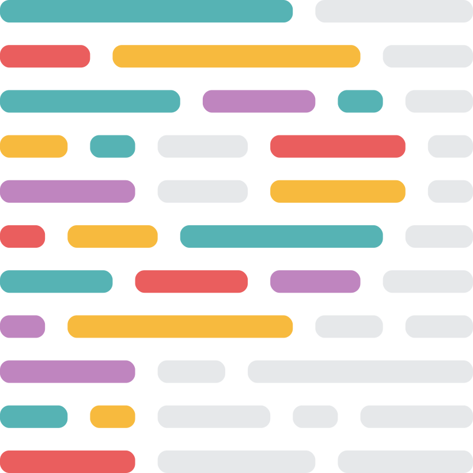

    
    <h1 align="center"> Portfolio Website Shared </h1>

> The actual frontend that is shown to visitors for the portfolio website.

## Table of Contents

- [Table of Contents](#table-of-contents)
- [Technologies Used](#technologies-used)
- [Setup](#setup)

## Technologies Used

<table>
<tbody>
    <tr align="center">
        <td align="center" width="12%">
            
        </td>
        <td align="center" width="12%">
            
        </td>
        <td align="center" width="12%">
             
        </td>
        <td align="center" width="12%">
            
        </td>
        <td align="center" width="12%">
            
        </td>
        <td align="center" width="12%">
            
        </td>
        <td align="center" width="12%">
            
        </td>
    </tr>
    <tr align="center">
        <td align="center" width="12%">
            <a href="https://www.gatsbyjs.com/">
                <b>
                    Gatsby
                </b>
            </a>
        </td>
        <td align="center" width="12%">
            <a href="https://react.dev/">
                <b>
                    React
                </b>
            </a>
        </td>
        <td align="center" width="12%">
            <a href="https://redux.js.org/">
                <b>
                    Redux
                </b>
            </a>
        </td>
        <td align="center" width="12%">
            <a href="https://sass-lang.com/">
                <b>
                    Sass
                </b>
            </a>
        </td>
        <td align="center" width="12%">
            <a href="https://threejs.org/">
                <b>
                    Three.js
                </b>
            </a>
        </td>
        <td align="center" width="12%">
            <a href="https://eslint.org/">
                <b>
                    ESLint
                </b>
            </a>
        </td>
        <td align="center" width="12%">
            <a href="https://prettier.io/">
                <b>
                    Prettier
                </b>
            </a>
        </td>
    </tr>
</tbody>
</table>

## Setup

- Run `npm i`
- Go to the [shared directory](../shared/)
  - Run `npm i`
  - Run `npm build`
  - Come back to [this directory](.)
- Run `npm run link`
- Run `npm run start`
